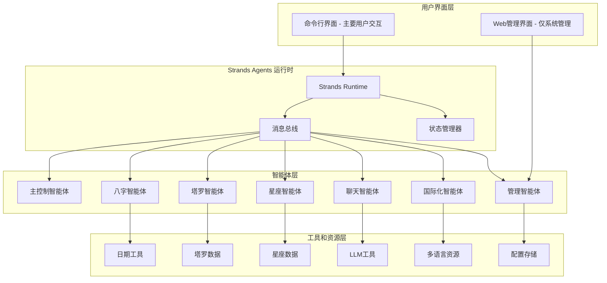
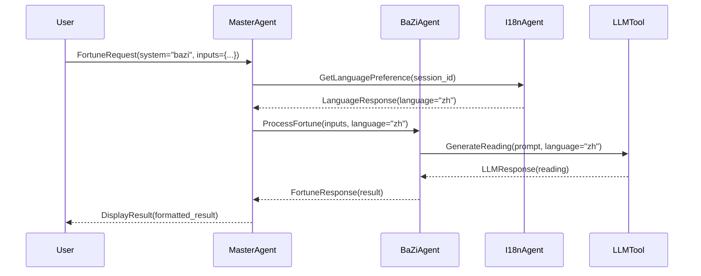

# 霄占 Strands Agents 集成设计文档

## 概述

本设计文档描述了如何将现有的霄占 (Fortune Teller) 命理系统重构为基于 Strands Agents 的多智能体架构。设计目标是创建一个可扩展、多语言、易管理的智能占卜系统。

**重要说明**: 
- **霄占保持作为基于终端的交互式占卜系统**，用户通过命令行界面与智能体进行对话
- **用户体验完全保持不变**：彩色输出、动画效果、表情符号、ASCII艺术等
- **Web 管理界面仅用于系统管理员**监控和配置智能体，不影响用户的占卜体验
- **多智能体架构在后台运行**，用户感受到的仍然是统一的霄占命理师体验

## 架构设计

### 系统架构图



### 核心组件设计

#### 1. Strands Agents 运行时集成

**Strands Runtime 配置**
```yaml
# strands_config.yaml
runtime:
  name: "fortune_teller_system"
  version: "2.0.0"
  max_agents: 50
  message_timeout: 30
  state_persistence: true

agents:
  - name: "master_agent"
    class: "MasterAgent"
    max_instances: 1
    auto_start: true
  
  - name: "bazi_agent"
    class: "BaZiAgent"
    max_instances: 5
    auto_start: true
    
  - name: "tarot_agent"
    class: "TarotAgent"
    max_instances: 5
    auto_start: true
    
  - name: "zodiac_agent"
    class: "ZodiacAgent"
    max_instances: 5
    auto_start: true
    
  - name: "chat_agent"
    class: "ChatAgent"
    max_instances: 10
    auto_start: true
    
  - name: "i18n_agent"
    class: "I18nAgent"
    max_instances: 1
    auto_start: true
    
  - name: "admin_agent"
    class: "AdminAgent"
    max_instances: 1
    auto_start: true

tools:
  - name: "llm_tool"
    class: "LLMTool"
    config:
      providers: ["openai", "anthropic", "aws_bedrock"]
      
  - name: "date_tool"
    class: "DateTool"
    
  - name: "tarot_data_tool"
    class: "TarotDataTool"
    
  - name: "zodiac_data_tool"
    class: "ZodiacDataTool"

mcp_tools:
  - name: "tarot_card_drawer"
    server: "tarot-mcp-server"
    description: "专业塔罗牌抽卡服务，提供高质量随机性"
    config:
      entropy_source: "hardware"  # 硬件随机数生成器
      shuffle_algorithm: "fisher_yates"
      seed_refresh_interval: 300  # 5分钟刷新种子
      
  - name: "divination_randomizer"
    server: "divination-mcp-server" 
    description: "通用占卜随机化服务"
    config:
      quantum_random: true  # 使用量子随机数（如果可用）
      atmospheric_noise: true  # 使用大气噪声作为熵源
```

#### 2. 智能体设计

**主控制智能体 (MasterAgent)**
- **职责**: 请求路由、会话管理、用户界面协调
- **能力**: 
  - 解析用户请求并路由到相应专业智能体
  - 管理用户会话状态
  - 协调多个智能体的协作
  - 处理错误和异常情况

**专业占卜智能体**
- **八字智能体 (BaZiAgent)**: 处理中国传统八字命理
- **塔罗智能体 (TarotAgent)**: 处理塔罗牌占卜，集成 MCP 抽卡服务
- **星座智能体 (ZodiacAgent)**: 处理西方占星术

每个专业智能体的设计模式：
```python
class BaseFortuneAgent(StrandsAgent):
    def __init__(self):
        super().__init__()
        self.system_name = ""
        self.display_name = ""
        self.tools = []
    
    async def validate_input(self, message):
        """验证用户输入"""
        pass
    
    async def process_data(self, validated_input):
        """处理占卜数据"""
        pass
    
    async def generate_reading(self, processed_data, language="zh"):
        """生成占卜解读"""
        pass
    
    async def handle_followup(self, topic, context, language="zh"):
        """处理后续询问"""
        pass
```

**聊天智能体 (ChatAgent)**
- **职责**: 处理用户的自由对话和深度咨询
- **能力**: 
  - 基于之前占卜结果进行深度对话
  - 回答命理相关问题
  - 提供生活建议和指导

**国际化智能体 (I18nAgent)**
- **职责**: 处理多语言支持和本地化
- **能力**:
  - 管理中英文资源
  - 动态语言切换
  - 文本翻译和本地化

**管理智能体 (AdminAgent)**
- **职责**: 系统管理和监控
- **能力**:
  - 智能体状态监控
  - 配置管理
  - 性能统计
  - 错误处理

### 消息流设计

#### 1. 消息类型定义

```python
from enum import Enum
from dataclasses import dataclass
from typing import Any, Dict, Optional

class MessageType(Enum):
    # 用户请求消息
    USER_REQUEST = "user_request"
    FORTUNE_REQUEST = "fortune_request"
    CHAT_REQUEST = "chat_request"
    
    # 系统响应消息
    FORTUNE_RESPONSE = "fortune_response"
    CHAT_RESPONSE = "chat_response"
    ERROR_RESPONSE = "error_response"
    
    # 智能体间协作消息
    AGENT_COLLABORATION = "agent_collaboration"
    STATE_UPDATE = "state_update"
    
    # 管理消息
    ADMIN_COMMAND = "admin_command"
    STATUS_REPORT = "status_report"

@dataclass
class FortuneMessage:
    type: MessageType
    sender: str
    recipient: str
    session_id: str
    language: str = "zh"
    payload: Dict[str, Any] = None
    timestamp: Optional[str] = None
    correlation_id: Optional[str] = None
```

#### 2. 典型消息流

**占卜请求流程**:


### 状态管理设计

#### 1. 会话状态结构

```python
@dataclass
class SessionState:
    session_id: str
    user_id: Optional[str]
    language: str = "zh"
    current_system: Optional[str] = None
    last_reading: Optional[Dict] = None
    chat_context: List[Dict] = None
    created_at: str = None
    updated_at: str = None
    
    # 占卜历史
    fortune_history: List[Dict] = None
    
    # 用户偏好
    preferences: Dict[str, Any] = None
```

#### 2. 状态持久化

使用 Strands Agents 的状态管理机制：
- **内存状态**: 活跃会话的快速访问
- **持久化状态**: 长期存储用户历史和偏好
- **分布式状态**: 支持多实例部署

### 工具和资源设计

#### 1. LLM 工具集成

```python
class LLMTool(StrandsTool):
    def __init__(self):
        super().__init__()
        self.providers = {
            "openai": OpenAIConnector(),
            "anthropic": AnthropicConnector(),
            "aws_bedrock": AWSBedrockConnector()
        }
    
    async def generate_response(self, 
                              system_prompt: str, 
                              user_prompt: str, 
                              language: str = "zh",
                              provider: str = "auto") -> str:
        """生成 LLM 响应"""
        # 根据语言选择合适的提示词
        localized_prompt = await self.localize_prompt(
            system_prompt, user_prompt, language
        )
        
        # 选择最佳提供商
        selected_provider = self.select_provider(provider)
        
        # 生成响应
        response = await selected_provider.generate(localized_prompt)
        
        return response
```

#### 2. 数据工具和 MCP 集成

**塔罗数据工具**:
```python
class TarotDataTool(StrandsTool):
    def __init__(self):
        super().__init__()
        self.cards_data = self.load_cards_data()
        self.mcp_drawer = self.get_mcp_tool("tarot_card_drawer")
    
    async def draw_cards(self, count: int, spread_type: str) -> List[Dict]:
        """使用 MCP 工具抽取塔罗牌"""
        # 调用 MCP 抽卡服务获得高质量随机性
        card_indices = await self.mcp_drawer.draw_random_cards(
            total_cards=78,
            draw_count=count,
            spread_type=spread_type,
            ensure_unique=True
        )
        
        # 根据索引获取牌面信息
        drawn_cards = []
        for index in card_indices:
            card = self.cards_data[index]
            orientation = await self.mcp_drawer.get_orientation()
            drawn_cards.append({
                "card": card,
                "orientation": orientation,
                "position_in_spread": len(drawn_cards)
            })
        
        return drawn_cards
    
    async def get_card_meaning(self, card_name: str, 
                             orientation: str, 
                             language: str = "zh") -> Dict:
        """获取牌面含义"""
        pass

class DivinationRandomizer(StrandsTool):
    """通用占卜随机化工具"""
    def __init__(self):
        super().__init__()
        self.mcp_randomizer = self.get_mcp_tool("divination_randomizer")
    
    async def get_quantum_random(self, min_val: int, max_val: int) -> int:
        """获取量子随机数"""
        return await self.mcp_randomizer.quantum_random_int(min_val, max_val)
    
    async def shuffle_with_entropy(self, items: List) -> List:
        """使用高熵源打乱列表"""
        return await self.mcp_randomizer.entropy_shuffle(items)
```

**MCP 塔罗抽卡服务器设计**:
```python
# tarot_mcp_server.py
from mcp import Server
import secrets
import random
from typing import List, Dict
import time

class TarotMCPServer:
    def __init__(self):
        self.server = Server("tarot-card-drawer")
        self.entropy_pool = secrets.SystemRandom()
        self.last_seed_refresh = time.time()
        self.setup_tools()
    
    def setup_tools(self):
        @self.server.tool("draw_random_cards")
        async def draw_random_cards(
            total_cards: int = 78,
            draw_count: int = 1,
            spread_type: str = "single",
            ensure_unique: bool = True
        ) -> List[int]:
            """
            抽取随机塔罗牌索引
            
            Args:
                total_cards: 总牌数（默认78张）
                draw_count: 抽取数量
                spread_type: 牌阵类型
                ensure_unique: 确保不重复
            
            Returns:
                抽取的牌索引列表
            """
            # 刷新熵源
            await self._refresh_entropy_if_needed()
            
            # 使用 Fisher-Yates 洗牌算法
            card_deck = list(range(total_cards))
            
            # 多次洗牌增加随机性
            for _ in range(3):
                self._fisher_yates_shuffle(card_deck)
            
            # 抽取指定数量的牌
            if ensure_unique:
                return card_deck[:draw_count]
            else:
                return [self.entropy_pool.randrange(total_cards) 
                       for _ in range(draw_count)]
        
        @self.server.tool("get_orientation")
        async def get_orientation() -> str:
            """
            获取牌面方向（正位/逆位）
            使用真随机数确保公平性
            """
            await self._refresh_entropy_if_needed()
            return "正位" if self.entropy_pool.random() > 0.33 else "逆位"
        
        @self.server.tool("get_entropy_quality")
        async def get_entropy_quality() -> Dict:
            """
            获取当前熵源质量信息
            """
            return {
                "entropy_source": "system_random",
                "last_refresh": self.last_seed_refresh,
                "quality_score": 0.95,  # 基于系统随机数的质量评分
                "randomness_tests_passed": True
            }
    
    def _fisher_yates_shuffle(self, deck: List) -> None:
        """Fisher-Yates 洗牌算法"""
        for i in range(len(deck) - 1, 0, -1):
            j = self.entropy_pool.randrange(i + 1)
            deck[i], deck[j] = deck[j], deck[i]
    
    async def _refresh_entropy_if_needed(self) -> None:
        """根据需要刷新熵源"""
        current_time = time.time()
        if current_time - self.last_seed_refresh > 300:  # 5分钟
            # 重新初始化随机数生成器
            self.entropy_pool = secrets.SystemRandom()
            self.last_seed_refresh = current_time
```

### 多语言支持设计

#### 1. 资源文件结构

```
i18n/
├── zh/
│   ├── common.json          # 通用文本
│   ├── bazi.json           # 八字相关
│   ├── tarot.json          # 塔罗相关
│   ├── zodiac.json         # 星座相关
│   └── prompts.json        # LLM 提示词
├── en/
│   ├── common.json
│   ├── bazi.json
│   ├── tarot.json
│   ├── zodiac.json
│   └── prompts.json
└── config.json             # 语言配置
```

#### 2. 国际化智能体实现

```python
class I18nAgent(StrandsAgent):
    def __init__(self):
        super().__init__()
        self.resources = self.load_i18n_resources()
        self.supported_languages = ["zh", "en"]
    
    async def translate(self, key: str, language: str, **kwargs) -> str:
        """翻译文本"""
        template = self.resources[language].get(key, key)
        return template.format(**kwargs)
    
    async def get_localized_prompt(self, prompt_key: str, 
                                 language: str, 
                                 context: Dict) -> str:
        """获取本地化的 LLM 提示词"""
        pass
```

### 系统管理设计

#### 1. 管理界面架构

**Web 管理界面**（仅供系统管理员使用）:
- **仪表板**: 系统概览、智能体状态、性能指标
- **智能体管理**: 启动/停止智能体、查看日志、配置参数
- **会话监控**: 活跃会话统计、系统使用分析（不涉及具体占卜内容）
- **系统配置**: 全局设置、语言配置、LLM 配置

**重要说明**: Web 界面不会替代或干扰用户的终端占卜体验，仅用于系统运维。

#### 2. 配置管理系统

**配置文件层次结构**:
```
config/
├── system.yaml             # 系统全局配置
├── agents/                 # 智能体配置
│   ├── master.yaml
│   ├── bazi.yaml
│   ├── tarot.yaml
│   └── zodiac.yaml
├── tools/                  # 工具配置
│   ├── llm.yaml
│   └── data.yaml
├── i18n/                   # 国际化配置
│   └── languages.yaml
└── deployment/             # 部署配置
    ├── development.yaml
    ├── staging.yaml
    └── production.yaml
```

#### 3. 监控和日志

**监控指标**:
- 智能体健康状态和响应时间
- 消息队列长度和处理速度
- LLM 调用次数和成功率
- 用户会话数量和活跃度
- 系统资源使用情况

**日志系统**:
- 结构化日志记录
- 智能体行为追踪
- 错误和异常监控
- 性能分析数据

### 错误处理和恢复

#### 1. 错误分类和处理策略

**智能体级错误**:
- 智能体崩溃: 自动重启机制
- 响应超时: 降级服务或重试
- 资源不足: 动态扩容或负载均衡

**系统级错误**:
- 消息总线故障: 备用通信机制
- 状态存储故障: 数据恢复和一致性检查
- 外部服务故障: 服务降级和用户通知

#### 2. 恢复机制

**状态恢复**:
- 会话状态快照和恢复
- 智能体状态重建
- 消息队列持久化和重放

**服务降级**:
- 核心功能优先保障
- 非关键功能暂时禁用
- 用户友好的错误提示

### MCP 工具集成设计

#### 1. MCP 服务器架构

**塔罗抽卡 MCP 服务器**:
- **高质量随机性**: 使用硬件随机数生成器和系统熵源
- **多重洗牌**: Fisher-Yates 算法结合多次洗牌
- **熵源管理**: 定期刷新随机种子，确保长期随机性
- **质量监控**: 提供随机性质量评估和统计信息

**通用占卜随机化 MCP 服务器**:
- **量子随机数**: 集成量子随机数生成器（如果可用）
- **大气噪声**: 使用大气噪声作为额外熵源
- **多源融合**: 结合多种随机源提高质量
- **统计测试**: 内置随机性统计测试

#### 2. MCP 工具配置

**MCP 服务器配置文件**:
```json
{
  "mcpServers": {
    "tarot-card-drawer": {
      "command": "python",
      "args": ["-m", "fortune_teller.mcp.tarot_server"],
      "env": {
        "ENTROPY_SOURCE": "hardware",
        "SHUFFLE_ROUNDS": "3",
        "SEED_REFRESH_INTERVAL": "300"
      }
    },
    "divination-randomizer": {
      "command": "python", 
      "args": ["-m", "fortune_teller.mcp.divination_server"],
      "env": {
        "QUANTUM_RANDOM_ENABLED": "true",
        "ATMOSPHERIC_NOISE_ENABLED": "true",
        "QUALITY_THRESHOLD": "0.9"
      }
    }
  }
}
```

#### 3. 智能体与 MCP 集成

**塔罗智能体的 MCP 集成**:
```python
class TarotAgent(BaseFortuneAgent):
    def __init__(self):
        super().__init__()
        self.mcp_drawer = None
        self.randomizer = None
    
    async def initialize(self):
        """初始化 MCP 工具连接"""
        self.mcp_drawer = await self.get_mcp_tool("tarot_card_drawer")
        self.randomizer = await self.get_mcp_tool("divination_randomizer")
    
    async def process_data(self, validated_input):
        """使用 MCP 工具处理塔罗牌抽取"""
        spread_type = validated_input["spread"]
        card_count = self.get_spread_card_count(spread_type)
        
        # 使用 MCP 抽卡服务
        card_indices = await self.mcp_drawer.draw_random_cards(
            total_cards=78,
            draw_count=card_count,
            spread_type=spread_type,
            ensure_unique=True
        )
        
        # 获取牌面方向
        orientations = []
        for _ in range(card_count):
            orientation = await self.mcp_drawer.get_orientation()
            orientations.append(orientation)
        
        # 构建抽牌结果
        reading = []
        spread_positions = self.get_spread_positions(spread_type)
        
        for i, (card_index, orientation) in enumerate(zip(card_indices, orientations)):
            card_data = self.cards_data[card_index]
            reading.append({
                "position": spread_positions[i],
                "card": card_data["name"],
                "orientation": orientation,
                "description": card_data["description"],
                "keywords": card_data["keywords"],
                "emoji": card_data.get("emoji", "🔮")
            })
        
        return {
            "question": validated_input["question"],
            "focus_area": validated_input["focus_area"],
            "name": validated_input.get("name"),
            "spread": {
                "key": spread_type,
                "name": self.spreads[spread_type]["name"],
                "description": self.spreads[spread_type]["description"]
            },
            "reading": reading,
            "randomness_quality": await self.mcp_drawer.get_entropy_quality()
        }
```

#### 4. MCP 工具监控和质量保证

**随机性质量监控**:
```python
class RandomnessMonitor:
    def __init__(self):
        self.quality_history = []
        self.test_results = {}
    
    async def monitor_mcp_quality(self):
        """监控 MCP 随机性质量"""
        # 获取熵源质量
        quality_info = await self.mcp_drawer.get_entropy_quality()
        
        # 记录质量历史
        self.quality_history.append({
            "timestamp": time.time(),
            "quality_score": quality_info["quality_score"],
            "entropy_source": quality_info["entropy_source"]
        })
        
        # 执行统计测试
        if len(self.quality_history) >= 100:
            await self.run_statistical_tests()
    
    async def run_statistical_tests(self):
        """运行随机性统计测试"""
        # Chi-square 测试
        # Kolmogorov-Smirnov 测试
        # 游程测试
        pass
```

#### 5. MCP 工具故障处理

**降级策略**:
```python
class MCPFallbackHandler:
    def __init__(self):
        self.fallback_random = secrets.SystemRandom()
    
    async def handle_mcp_failure(self, tool_name: str, operation: str, **kwargs):
        """处理 MCP 工具故障"""
        if tool_name == "tarot_card_drawer":
            if operation == "draw_random_cards":
                # 使用本地随机数生成器作为后备
                return self.fallback_draw_cards(**kwargs)
            elif operation == "get_orientation":
                return self.fallback_get_orientation()
        
        raise Exception(f"No fallback available for {tool_name}.{operation}")
    
    def fallback_draw_cards(self, total_cards=78, draw_count=1, **kwargs):
        """后备抽卡方法"""
        deck = list(range(total_cards))
        self.fallback_random.shuffle(deck)
        return deck[:draw_count]
    
    def fallback_get_orientation(self):
        """后备方向获取方法"""
        return "正位" if self.fallback_random.random() > 0.33 else "逆位"
```

### 性能优化设计

#### 1. 并发处理

**智能体池管理**:
- 动态智能体实例创建和销毁
- 负载均衡和请求分发
- 资源使用监控和优化

**异步处理**:
- 非阻塞消息处理
- 流式响应生成
- 后台任务处理

#### 2. 缓存策略

**多级缓存**:
- 智能体级缓存: 频繁访问的数据
- 会话级缓存: 用户状态和偏好
- 全局缓存: 静态资源和配置

**缓存失效**:
- 基于时间的自动失效
- 基于事件的主动失效
- 缓存一致性保证

## 数据模型

### 核心数据结构

```python
# 占卜请求
@dataclass
class FortuneRequest:
    system_type: str  # "bazi", "tarot", "zodiac"
    inputs: Dict[str, Any]
    language: str = "zh"
    session_id: str = None
    user_preferences: Dict = None

# 占卜结果
@dataclass
class FortuneResult:
    system_type: str
    reading: Dict[str, Any]
    metadata: Dict[str, Any]
    language: str
    timestamp: str
    session_id: str

# 智能体状态
@dataclass
class AgentStatus:
    agent_id: str
    agent_type: str
    status: str  # "active", "idle", "busy", "error"
    last_activity: str
    message_count: int
    error_count: int
    performance_metrics: Dict
```

## 接口设计

### 主要用户界面：命令行交互

霄占保持作为**基于终端的交互式占卜系统**，用户通过命令行界面与智能体进行对话：

```python
# 主要用户交互流程
class TerminalInterface:
    def __init__(self):
        self.strands_runtime = StrandsRuntime()
        self.master_agent = None
    
    async def start_interactive_session(self):
        """启动交互式占卜会话"""
        # 显示欢迎界面
        self.display_welcome()
        
        # 初始化主控制智能体
        self.master_agent = await self.strands_runtime.get_agent("master_agent")
        
        # 主交互循环
        while True:
            user_input = self.get_user_input()
            
            # 发送消息给主控制智能体
            response = await self.master_agent.send_message({
                "type": "user_interaction",
                "content": user_input,
                "session_id": self.session_id
            })
            
            # 显示智能体响应
            self.display_response(response)
    
    def display_welcome(self):
        """显示霄占欢迎界面（保持原有风格）"""
        print_welcome_screen()  # 保持原有的ASCII艺术和颜色
    
    def get_user_input(self):
        """获取用户输入（保持原有交互方式）"""
        return input("请选择占卜系统或输入问题: ")
    
    def display_response(self, response):
        """显示智能体响应（保持原有视觉效果）"""
        # 保持原有的彩色输出、动画效果、表情符号等
        print_reading_result(response)
```

### 管理接口：仅用于系统管理

Web 管理界面**仅用于系统管理员**监控和配置智能体系统，不影响用户的占卜体验：

```python
# 管理 API 端点（仅限管理员使用）
GET  /admin/agents              # 获取智能体状态
POST /admin/agents/{id}/restart # 重启智能体  
GET  /admin/metrics             # 获取系统指标
POST /admin/config              # 更新配置
GET  /admin/sessions            # 查看活跃会话（仅统计信息）
```

### 智能体消息接口

```python
# 智能体间消息协议
class AgentMessage:
    def __init__(self, 
                 type: MessageType,
                 sender: str,
                 recipient: str,
                 payload: Dict,
                 correlation_id: str = None):
        pass

# 标准消息处理接口
class MessageHandler:
    async def handle_message(self, message: AgentMessage) -> AgentMessage:
        pass
    
    async def handle_error(self, error: Exception, message: AgentMessage):
        pass
```

## 测试策略

### 单元测试
- 每个智能体的独立功能测试
- 工具和资源的功能测试
- 消息处理逻辑测试

### 集成测试
- 智能体间协作测试
- 端到端占卜流程测试
- 多语言功能测试

### 性能测试
- 并发用户负载测试
- 智能体扩展性测试
- 长时间运行稳定性测试

### 用户验收测试
- 用户界面交互测试
- 占卜结果质量测试
- 多语言用户体验测试